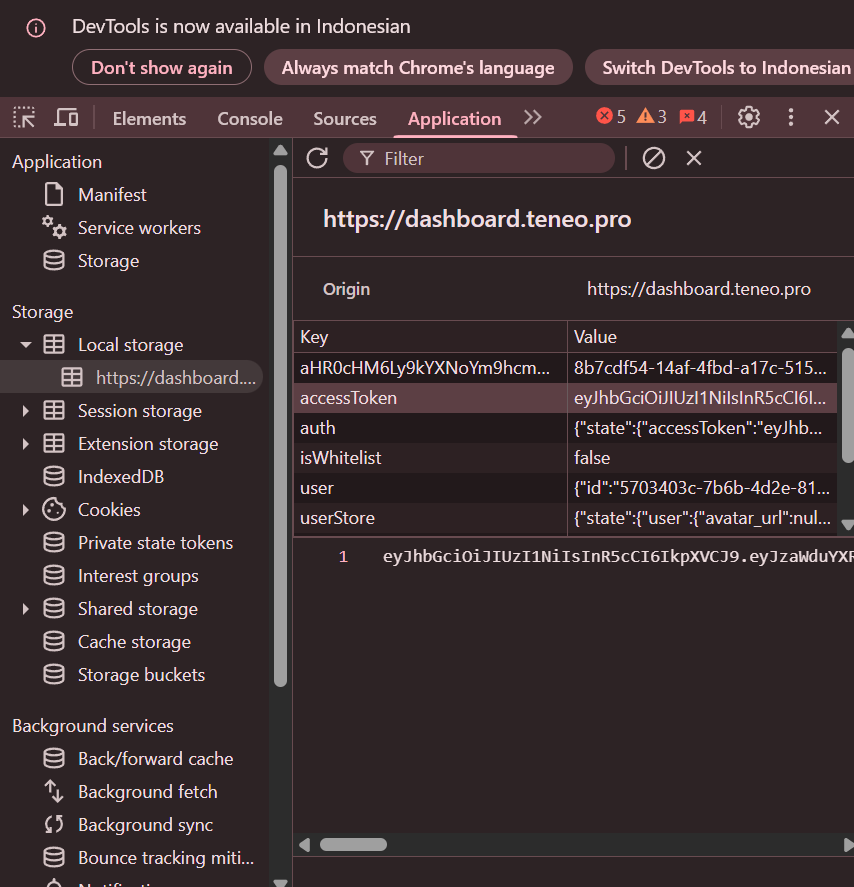

# Teneo Agent Insights BOT
Teneo Agent Insights BOT

- Contact me if u want: [Vonssy](https://t.me/vonssy_2nd)
- Price? Only $5

## Features

  - Auto Get Account Information
  - Auto Run With [Free Proxyscrape](https://proxyscrape.com/free-proxy-list) Proxy - `Choose 1`
  - Auto Run With Private Proxy - `Choose 2`
  - Auto Run Without Proxy - `Choose 3`
  - Auto Rotate Invalid Proxies - `y` or `n`
  - Auto Retrive Access Tokens
  - Auto Connected With Agent Insights Node Extension
  - Multi Accounts With Threads

## Requiremnets

- Make sure you have Python3.9 or higher installed and pip.
- Have Access to Teneo Agent Isights
- 2captcha key (optional)

## Instalation

1. **Extract .ZIP:**
   ```bash
   unzip TeneoAgent-BOT.zip
   ```
   ```bash
   cd TeneoAgent-BOT
   ```

2. **Install Requirements:**
   ```bash
   pip install -r requirements.txt #or pip3 install -r requirements.txt
   ```

## Configuration

- **2captcha_key.txt:** You will find the file `2captcha_key.txt` inside the project directory. Make sure `2captcha_key.txt` contains data that matches the format expected by the script. Here are examples of file formats:
  ```bash
    your_2captcha_key
  ```

- **accounts.json:** You will find the file `accounts.json` inside the project directory. Make sure `accounts.json` contains data that matches the format expected by the script. Here are examples of file formats:
  ```json
    [
        {
            "Email": "your_email_address_1",
            "Password": "your_password_1"
        },
        {
            "Email": "your_email_address_2",
            "Password": "your_password_2"
        }
    ]
  ```

### Note

- If you don't have a 2cpatcha key, you can fetch the data manually and put it in tokens.json according to the format.

<div style="text-align: center;">
  
</div>
  
- **tokens.json:** You will find the file `tokens.json` inside the project directory. Make sure `tokens.json` contains data that matches the format expected by the script. Here are examples of file formats:
  ```json
    [
        {
            "Email": "your_email_address_1",
            "accessToken": "your_access_token_1"
        },
        {
            "Email": "your_email_address_2",
            "accessToken": "your_access_token_2"
        }
    ]
  ```

- **proxy.txt:** You will find the file `proxy.txt` inside the project directory. Make sure `proxy.txt` contains data that matches the format expected by the script. Here are examples of file formats:
  ```bash
    ip:port # Default Protcol HTTP.
    protocol://ip:port
    protocol://user:pass@ip:port
  ```

## Setup

```bash
python setup.py #or python3 setup.py
```

## Run

```bash
python bot.py #or python3 bot.py
```

## Buy Me a Coffee

- **EVM:** 0xe3c9ef9a39e9eb0582e5b147026cae524338521a
- **TON:** UQBEFv58DC4FUrGqinBB5PAQS7TzXSm5c1Fn6nkiet8kmehB
- **SOL:** E1xkaJYmAFEj28NPHKhjbf7GcvfdjKdvXju8d8AeSunf
- **SUI:** 0xa03726ecbbe00b31df6a61d7a59d02a7eedc39fe269532ceab97852a04cf3347

Thank you for visiting this repository, don't forget to contribute in the form of follows and stars.
If you have questions, find an issue, or have suggestions for improvement, feel free to contact me or open an *issue* in this GitHub repository.

**vonssy**